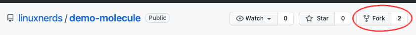
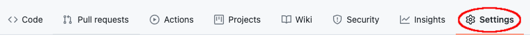
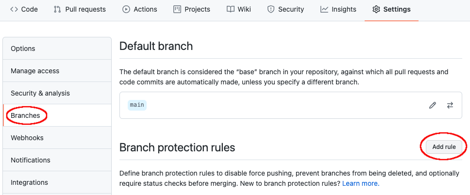
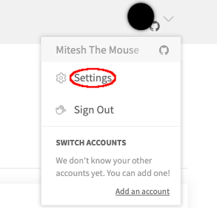
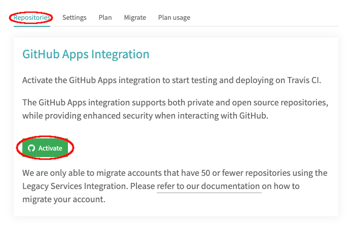
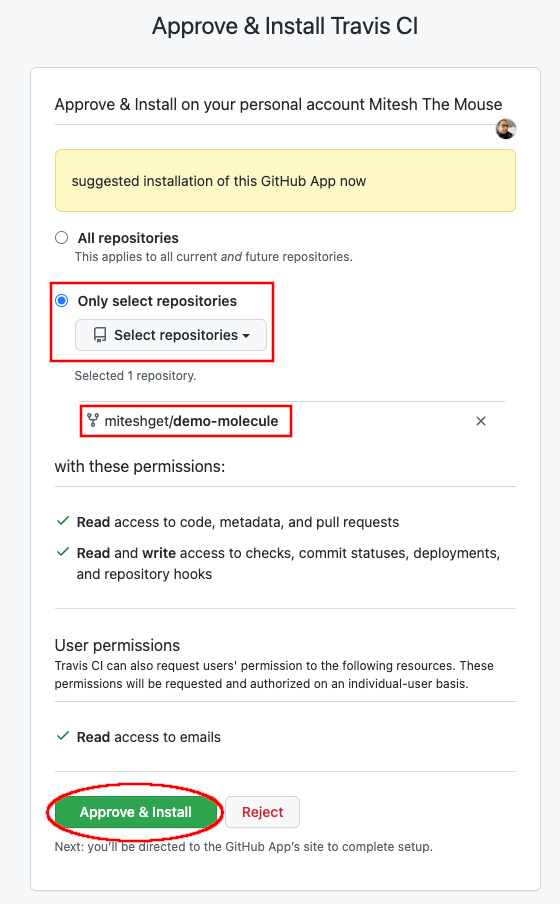
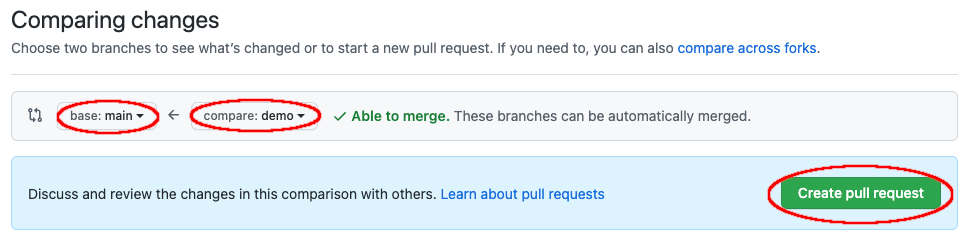
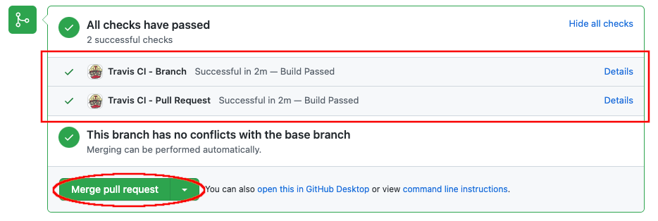
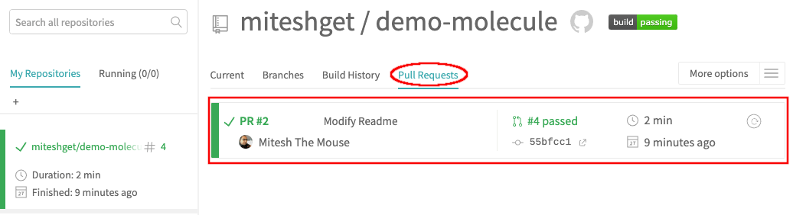

:scrollbar:
:data-uri:
:linkattrs:
:toc2:
:numbered:
:blog_name: Testing Ansible Collection Roles with Molecule and integration with Travis CI using Github Actions
:description: Testing Ansible Collection Roles with Molecule and integration with Travis CI using Github Actions
:keywords: molecule, ansible collection, travis-ci

= {blog_name}

== Introduction

[.lead;.text-center]
Red Hat Automation Platform is an IT automation tool which allows enterprises to automate their IT systems in a declarative way.  Ansible Automation Platform makes it possible for users across an organization to create, test, and manage automation content through a powerful and agentless framework.
[.normal;.text-center]
Red Hat Ansible Automation Platform uses playbooks to define the end state of the IT systems in a declarative manner.  Playbooks are written in YAML format. YAML stands for Yet Another Markup Language. Playbooks are one of the core features of Ansible and tell Ansible what to execute. They are like a to-do list for Ansible that contains a list of tasks.
[.normal;.text-center]
Like every coding language, Ansible playbooks also need a testing framework to verify the code. Molecule project provides testing tools for Ansible roles. Molecule can provision local infrastructure to test Ansible roles/playbooks. 
[.normal;.text-center]
Ansible Content Collections, or collections, the standard way of distributing, maintaining and consuming automation. Ansible Content collections allows developers to combine Ansible content (playbooks, roles, modules, and plugins) in a flexible and scalable way. 
[.normal;.text-center]
As most of the Ansible content is moving into Ansible content collections we need to figure out how Molecule testing will work with roles defined in Ansible collections. This article will be focussing on testing roles defined under Ansible collections and later we will discuss using Travis CI with Github to test Ansible roles. 

== Part 1: Testing with Molecule 
[.normal;.text-justify]
It’s been a long time since the Molecule project was helping developers to test their roles. We have been using Molecule for quite a while to test our roles mostly for idempotency and syntax checks. 
[.normal;.text-justify]
As our team gradually decided to move our roles to Ansible collections, the first challenge was how we would use Molecule to test our roles defined in the collections. I and Mitesh took this challenge.
[.normal;.text-justify]
On the way, we came across several small battles which we had to overcome to win the War.

[.normal]
* Let us take you on a journey of making our collections ready for Molecule.  

+
Here is our repo https://github.com/linuxnerds/demo-molecule which you can use to follow along. 
+
We would recommend forking the repo in your GitHub account before proceeding and then clone it.
+
====
.Repository fork button

====

* Let’s explore the forked repository contents. 

+
[source,ssh]
----
$ git clone https://github.com/<github-id>/demo-molecule.git
Cloning into 'demo-molecule'...
----

* List of files inside cloned directory. 
+
.training.demo collection
[source,ssh]
----
$ tree demo-molecule/
.
├── ansible.cfg
├── collections
│   └── ansible_collections
│       └── training
│           └── demo
│               ├── galaxy.yml
│               ├── plugins
│               │   ├── modules
│               │   │   ├── diskspace.py
│               │   │   └── __init__.py
│               │   └── README.md
│               ├── README.md
│               └── roles
│                   └── diskstat
│                       ├── defaults
│                       │   └── main.yml
│                       ├── handlers
│                       │   └── main.yml
│                       ├── meta
│                       │   └── main.yml
│                       ├── README.md
│                       ├── tasks
│                       │   └── main.yml
│                       ├── tests
│                       │   ├── inventory
│                       │   └── test.yml
│                       └── vars
│                           └── main.yml
├── LICENSE
├── molecule
│   └── default
│       ├── converge.yml
│       ├── INSTALL.rst
│       ├── molecule.yml
│       └── verify.yml
├── README.adoc
└── requirements.txt
----

[NOTE]
In our team mostly, we use RHEL 8.x as our development systems, so everything which you see here is based on running CLI on RHEL 8.x. 

* We started by creating a python3 virtual environment called demo, and installed all the packages needed for Molecule. We would recommend creating a virtual environment for your own testing. In the python3 virtualenv we installed ansible, molecule==3.5.1 and molecule-podman==1.0.1 packages. You can use requirements.txt from the cloned repository to install packages. 

* Molecule uses drivers to bring up hosts to operate on, currently Molecule supports Vagrant, Openstack and docker as drivers. We were more comfortable with podman and luckily Molecule Podman drivers project is already available. Still Molecule Podman is in the early stages of development, it worked for us. 

+
[source,ssh]
----
$ python3 -m venv demo
$ source demo/bin/activate
(demo) $ pip install -r demo-molecule/requirements.txt
----

* If you would like to verify molecule and molecule-podman drivers are installed and working. 
+
[source,ssh]
----
(demo) $ molecule --version
molecule 3.5.1 using python 3.6 
    ansible:2.11.2
    delegated:3.5.1 from molecule
    podman:1.0.1 from molecule_podman requiring collections: containers.podman>=1.7.0 ansible.posix>=1.3.0
----

* List of the installed molecule drivers
+
[source,ssh]
----
$ molecule drivers
-----------------------------------
delegated
podman                                     
----

* We wanted to keep it simple.  As part of our testing we started with a collection named learning.demo with a simple role in it called diskstat which uses a custom module diskspace. 
+
If you want to view the custom module. It is located at  collections/ansible_collections/training/demo/plugins/modules/diskspace.py

* Below is the snippet of diskstat role.

+
[source,ssh]
----
---
- name: start
  debug:
    msg: "Start disk stat"

- name: diskspace module
  training.demo.diskspace: <1>
    path: /tmp
    storage: true
  register: output

- name: disk stat output
  debug:
    msg: "{{ output }}"

- name: end
  debug:
    msg: "End disk stat"
----
<1> In the above snippet you can see we are calling diskspace module using FQCN (Fully Qualified Collection Name) in role. The diskspace module checks the disk utilization of a directory. In our case we are using /tmp/.

As of now we are ready with our Ansible content collection, let's move to the fun part and which was a challenge for us. Initially we were using molecule init  to initialize the role which also creates all the directories under role for Molecule. 
+
But this was different now we have to deal with the roles defined in collection and currently molecule init does not support initialization of collections. Good thing for us even though init does not support collection but it supports adding molecule scenarios for an existing role. Being innovative we added the molecule scenario directory in our project directory. First battle was won. 

* Just for testing purposes we added only the default scenario by running following commands
+
[source,ssh]
----
$ cd demo-molecule
$  molecule init scenario --driver-name podman default
----

* List of files created under default molecule scenario.
+
[source,ssh]
----
$ tree molecule
molecule
└── default
    ├── converge.yml <1>
    ├── INSTALL.rst
    ├── molecule.yml <2>
    └── verify.yml <3>

1 directory, 4 files
----

<1> Let’s talk about converge.yml, it is the playbook file where we defined our role diskstat using FQCN. Molecule will invoke converge.yml to run playbook against the instance created by Podman driver.
+
[source,ssh]
----
$ cat molecule/default/converge.yml 
---
- name: Converge
  hosts: all
  tasks:
    - name: "Include diskstat role"
      include_role:
        name: "training.demo.diskstat"
----

<2> Next step was to configure molecule.yml, it is the central configuration entrypoint for Molecule. With this file, you can configure each tool that Molecule will employ when testing your role. 
+
We did not really want to run a full stack of test sequences so We customised the  test_sequence according to our requirements.
+
[source,ssh]
----
$ cat demo-molecule/molecule/default/molecule.yml 
---
scenario:
  name: default
  test_sequence:
    - dependency
    - lint
    - cleanup
    - destroy
    - syntax
    - create
    - prepare
    - converge
    - side_effect
    - verify
    - cleanup
    - destroy
dependency:
  name: galaxy
driver:
  name: podman
platforms:
  - name: instance
    image: docker.io/pycontribs/centos:7
    pre_build_image: true
provisioner:
  name: ansible
verifier:
  name: ansible

----

<3> Molecule handles role testing by invoking configurable verifiers using verify.yml. For our test use case we did not bother to touch it. 

* Here comes the war and we were ready to see if the molecule test command works to test our Ansible collection and role defined in the collection.
+
[source,ssh]
----
$ molecule test

INFO     default scenario test matrix: dependency, lint, cleanup, destroy, syntax, create, prepare, converge, side_effect, verify, cleanup, destroy
INFO     Performing prerun...

	-----<Output omitted for better view>-----

PLAY RECAP *********************************************************************
localhost         : ok=2    changed=2    unreachable=0    failed=0    skipped=0    rescued=0    ignored=0

INFO     Pruning extra files from scenario ephemeral directory

----

Hurray we won the battle, we could get the molecule to test our Ansible content collection role. 

== Part 2: Molecule Testing with CI

As we have successfully made our Ansible collectections working locally, the next step was to make sure it works with CI. We aggressively use GitHub with Hosted Travis CI. Travis CI and Molecule enable our team to test and host our roles before we start using Prod.  

We have more then 80 contributors who are continuously enhancing our roles, daily we are getting many PRs for new roles, enhancements or for bug fixes. It's a very difficult job to test each and every PR from feature branches before they are merged in our Prod branch. 

Travis CI and Molecule play a vital role in our environment and helps to build confidence in our Approvers before they merge a PR. 

Many of you guys must be using Jenkins, Travis or Tekton for organizational CI needs. Our plan is also Gradually moving to run Tekton on the Openshift Cluster. But till then just for the sake of the Blog we are sticking to Hosted Travis CI and Gituhub. 

It’s not rocket science to make GitHub and Travis work together. We thought let us show how we set up Github and Travis. And then use a .travis file to configure the molecule.  

. Let us start with configuring Github by clicking on Settings .

+
====

====

. Click on branches and then click on add rule button
+
====

====

. Type main in Branch name pattern box
. Select Require a pull request before merging or modify rules as per your requirement and then click Create button.

In the above steps we configured Github branch main  to not allow Merging before a Pull request is created from a feature branch by a developer.

Let's move to the next step to configure Travis CI and authorise it to Read content from our GitHub repository.

. Go to travis-ci.com
. Sign-in with Github account
+
====

====

. Go to settings
+
====

====

. Click on Repositories -> Activate button
+
====

====

. Select Only select repository and select demo-molecule (forked repository), then click Approve & install
+
====

====

. Click Repositories -> demo-molecule

Spot on we are done, now Travis can look after GitHub Repositories as soon as a PR gets created. 

To make Travis CI run Molecule tests, we need to create .travis.yml in our repository. All the steps which we did manually to make our Molecule run locally, we needed Travis to do. Here is the Travis file which we are using:

[source,ssh]
----
$ cat demo-molecule/.travis.yml

sudo: required
language: python
before_install:
  - sudo apt-get update
  - sudo apt-get install -y software-properties-common
  - sudo add-apt-repository -y ppa:projectatomic/ppa
  - sudo apt-get update
  - sudo apt-get install -y podman
  - pwd

install:
  - pip install -r requirements.txt <1>
script:
  - molecule test <2>
----
<1> requirement file for molecule we kept in Github repository.
<2> Run Molecule Test

For testing purposes, we created a demo branch and created a PR to verify Molecule is running tests on the PR before our Approver can Merge in the main branch. 

. Create feature Branch demo
[source,ssh]
----
$ cd demo-molecule
$ git checkout -b demo
----

. Make a change in README.adoc file 

[source,ssh]
----
$ cat >> README.adoc <EOF
Demo 
EOF
----

. Pushed the changes in demo branch 
[source,ssh]
----
$ git add README.adoc 
$ git commit -m "Modify Readme"
$ git push --set-upstream origin demo
----

. Create Pull Request from demo branch to main branch 

.. GitHub forked repository
.. Click Pull requests and then click New pull request
.. Select main for base branch and demo for compare

+
====

====

.  Then click on Create pull request and again click on Create pull request button
+
====

====

Boom!!!! Here comes CI to run Molecule tests on Pull Request.

. Just to check, that molecule really did the magic of testing the PR on Travis CI. 
+
====

====

The journey to overcome all the challenges was quite overwhelming for us. We would recommend to all the Ansible developers to follow the principles of Test Driven Development of their Ansible content collections and roles. 

We will soon be bringing a blog for Tekton CI running on Red Hat Openshift 4.x and making a molecule to do its testing magic.  

